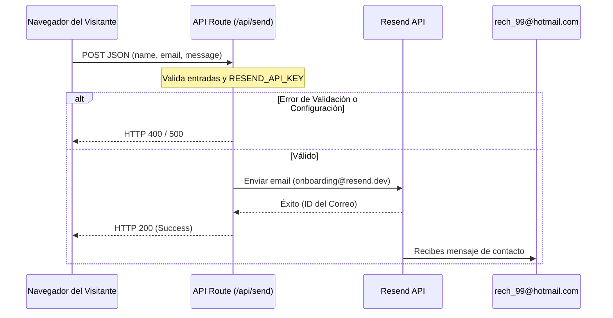

# Diseño de Integración de Correo con Resend

Este documento detalla el diseño técnico para habilitar el envío de correos reales desde el formulario de contacto del portafolio.

## 1. Resumen de Entendimiento
*   **Qué se construye**: Ruta de API `/api/send` en Next.js App Router conectada a la API de Resend para procesar el formulario de contacto.
*   **Para quién**: El desarrollador/dueño del portafolio (`rech_99@hotmail.com`) recibe los correos y los visitantes los envían.
*   **Restricciones**:
    *   Capa gratuita de Resend (máximo 3,000 envíos/mes).
    *   Remitente por defecto `onboarding@resend.dev` (sin dominio personalizado).
    *   Destinatario exclusivo: `rech_99@hotmail.com` (correo registrado en Resend).
    *   Las credenciales deben estar ocultas en variables de entorno.
*   **No-Objetivos**: Enviar correos de respuesta automáticos a terceros o almacenar mensajes en bases de datos locales.

## 2. Registro de Decisiones (Decision Log)
*   **Proveedor**: Resend. Elegido por su simplicidad en Next.js y excelente rendimiento.
*   **Arquitectura**: Next.js API Route Handler (`/api/send`). Elegido por sobre Server Actions para mayor desacoplamiento y flexibilidad ante futuros cambios.
*   **Remitente**: `onboarding@resend.dev`. Elegido para evitar costos de dominio en esta fase y garantizar funcionamiento inmediato en producción.

## 3. Arquitectura del Sistema


## 4. Estructura de Código Propuesta

### `.env.local`
```env
RESEND_API_KEY=
```

### `app/api/send/route.ts`
```typescript
import { NextResponse } from 'next/server';
import { Resend } from 'resend';

// Validar clave en tiempo de ejecución
const apiKey = process.env.RESEND_API_KEY;
const resend = apiKey ? new Resend(apiKey) : null;

export async function POST(req: Request) {
  try {
    if (!resend) {
      return NextResponse.json(
        { error: 'El servicio de correo no está configurado (falta RESEND_API_KEY).' },
        { status: 500 }
      );
    }

    const { name, email, message } = await req.json();

    // Validaciones sencillas de backend
    if (!name || !email || !message) {
      return NextResponse.json(
        { error: 'Todos los campos (nombre, correo y mensaje) son requeridos.' },
        { status: 400 }
      );
    }

    const { data, error } = await resend.emails.send({
      from: 'Portfolio Contact <onboarding@resend.dev>',
      to: ['rech_99@hotmail.com'],
      subject: `Nuevo mensaje de contacto de ${name}`,
      replyTo: email,
      text: `Nombre: ${name}\nCorreo de contacto: ${email}\n\nMensaje:\n${message}`,
    });

    if (error) {
      return NextResponse.json({ error: error.message }, { status: 500 });
    }

    return NextResponse.json({ success: true, data });
  } catch (err: any) {
    return NextResponse.json({ error: err.message || 'Error interno del servidor.' }, { status: 500 });
  }
}
```

## 5. Criterios de Aceptación
1.  Si el usuario no rellena algún campo obligatorio, el formulario frontend detiene el envío.
2.  Al presionar enviar, el botón cambia su estado a "Enviando..." y se deshabilita para evitar peticiones duplicadas.
3.  Si el correo se envía correctamente, se muestra un mensaje de éxito con fondo verde/azul y el formulario se limpia.
4.  Si hay un error del servidor, se muestra un mensaje de error en rojo pidiendo intentarlo más tarde o enviar directamente a `rech_99@hotmail.com`.
